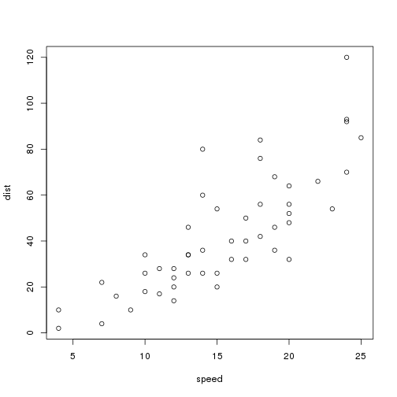

diateam : SCAD@COPS
========================================================
author: Lisa MALIPHOL
date:   28 septembre 2015
transition: rotate


Introduction
========================================================

# diateam

# SCAD@COPS 

Un système hybride de détéction d'intrusion de réseau


Présentation
========================================================

- L'introduction
- Les systèmes industriels
- Les protocols
- Des attaques
- Les systèmes de détection d'intrusion
- La détection d'intrusion basée sur des anomalies
- La source de données
- L'analyse de données exploiratoire (EDA)
- Le preuve de concept
- Les indicateurs statistiques


Les systèmes industriels
========================================================


```r
summary(cars)
```

```
     speed           dist       
 Min.   : 4.0   Min.   :  2.00  
 1st Qu.:12.0   1st Qu.: 26.00  
 Median :15.0   Median : 36.00  
 Mean   :15.4   Mean   : 42.98  
 3rd Qu.:19.0   3rd Qu.: 56.00  
 Max.   :25.0   Max.   :120.00  
```

Les protocols
========================================================

 


Des attaques
========================================================


Les systèmes de détection d'intrusion
========================================================


La détection d'intrusion basée sur des anomalies
========================================================


La source de données
========================================================


L'analyse de données exploiratoire
========================================================


Le preuve de concept
========================================================


Les indicateurs statistiques
========================================================


